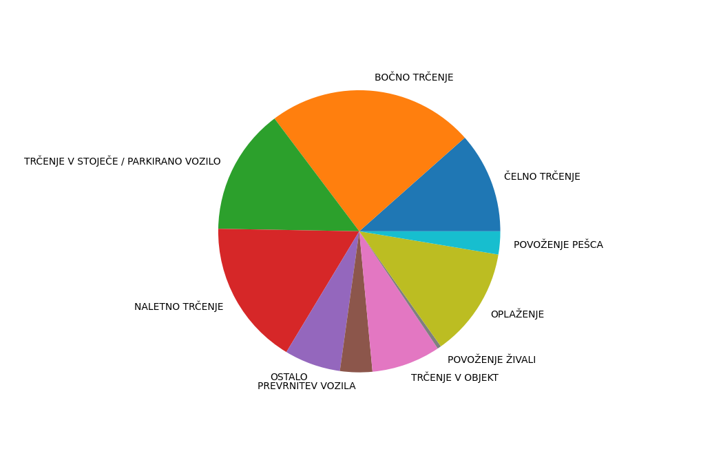
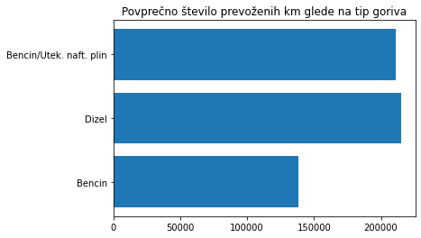
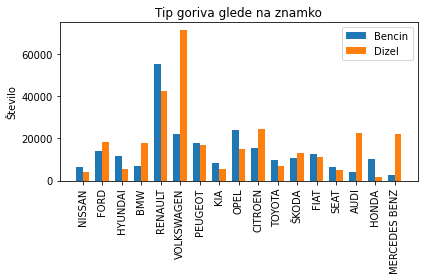
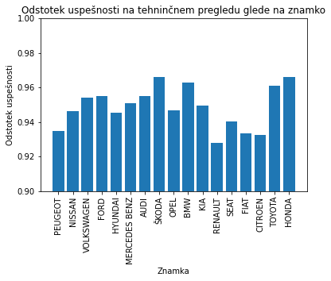
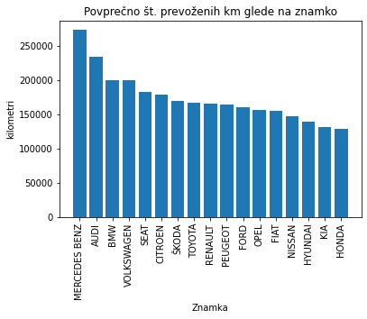
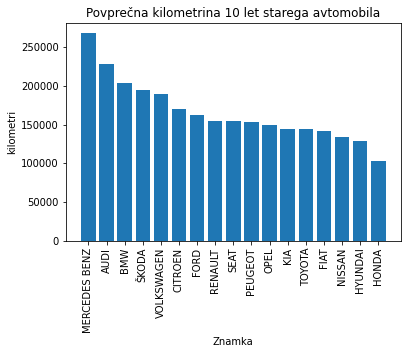

# Analiza prometa v Sloveniji

## Opis podatkov

### Prometne nesreče
Podatke o prometnih nesrečah smo pridobili iz spletne strani policija.si, kjer so objavljeni podatki o vseh prometnih nesrečah od leta 1995 do leta 2020. Za vsako nesrečo imamo podatke o vozilu, poškodbah, cestišču, itd. Pri nekaterih nesrečah niso znani vsi podatki, zato je bilo potrebno pri določenih izračunih upoštevati le tiste podatke, ki so bili korektni.

### Registrirana vozila v Sloveniji
Vse podatke o registriranih vozilih smo pridobili na podatki.gov.si, kjer so vidni vsi podatki o trenutno registriranih vozilah v Sloveniji do vključno leta 2020.  
V datoteki imamo vidne podatke o lastniku vozila in vozilu.

### Napake na tehničnih pregledih
Tabelo s podatki smo dobili s spletne strani https://podatki.gov.si. V tabeli so zapisani podatki o neuspešnih tehničnih pregledih.

### Javni promet
Podatke o javnem prometu so pridobljeni iz spletne strani https://pxweb.stat.si/SiStatData.

## Vizualizacija

### Prometne nesreče
Najprej nas je zanimalo koliko je vseh tipov nesreč in kakšen je njihov delež. Ugotovili smo, da je najbolj pogost tip nesreče bočno trčenje, čeprav smo predvidevali, da bo najbolj pogost tip nesreče oplaženje. Uporabili smo še podatke iz leta 2010 in ugotovili, da ni bistvene razlike pri porazdelitvi.

Delež nesreč 2020            |  Delež nesreč 2010
:-------------------------:|:-------------------------:
  |  

Nadaljevali smo z deležem uporabe varnostnega pasu pri različnih tipih nesreč. Pri predvidevanju smo se zopet zmotili, saj smo mislili, da bo največji delež neuporabe varnostnega pasu pri trčenju v stoječe/parkirano vozilo. Po izračunih smo ugotovili, da je največ nepripetih pasov pri povoženju pešca in to več kot 25%, najmanj pa pri naletnem trčenju, manj kot 2%. Zelo podobne rezultate smo dobili tudi pri podatkih iz leta 2010. Ponovno je največ nepripetih pasov pri povoženju pešca, najmanj pa pri naletnem trčenju.

||  Delež nesreč
|:-------------------------:|:-------------------------:
|Delež Nesreč 2020|")
|Delež Nesreč 2010|")

Zanimalo nas je tudi kakšen je delež moških in žensk, ki so bili pri prometni nesreči pod vplivom alkohola. Ugotovili smo, da je delež moških pod vplivom alkohola približno 3-krat večji kot delež žensk pod vplivom alkohola. Pri podatkih iz leta 2010 nas je presentilo, da se je delež voznikov pod vplivom alkohola do leta 2020 povečal za kar 10 odstotkov.

Delež voznikov pod vplivom alkohola 2020 | Delež voznikov pod vplivom alkohola 2010
:-------------------------:|:-------------------------:
")  |  ")

Po teh izračunih smo naredili še graf, ki prikazuje vzrok nesreče glede na spol in graf, ki prikazuje tipe nesreč glede na stanje prometa.

### Registrirana vozila v Sloveniji
V podatkih smo razbrali koliko vozil je v sloveniji registriranih, ocenili smo njihov delež in zaradi prevelikega števila znamk smo se omejili le na 10 najpogostejših. Seveda se pri voznem parku razlikuje ali je lastnik moški ali ženska.

    

Preverili smo kakšen delež vseh osebnih vozil je v lasti fizične osebe in kakšen delež je od pravne osebe.

Kot zadnje nas je pa zanimala povprečna starost lastnikov najpopularnejših znamk

### Tehnični pregledi

Najprej smo si hoteli pogledati, kateri tip vozila najpogosteje ne pride čez tehnični pregled. Vidimo, da je osebnih avtomobilov največ.

 
Nato smo si hoteli pogledati, kakšen je delež napak posameznega tipa.

 
Vidimo, da ima velika večina vozil težave z svetlobno in električno opremo.
  
Hoteli smo preveriti, če so določeni tipi napak pogostejši glede na tip vozila. 

Opazimo, da velika večina vozil ne opravi tehničnega pregleda zaradi svetlobne in električne opreme. Pri tovornih vozilih, traktorjih in vlečnih vozilih je dokaj pogosta napaka druga oprema(oprema manjka ali pa ni v skladu z zahtevami).

  
Poglejmo si še povprečno število prevoženih kilometrov glede na tip goriva.

Opazimo, da Avtomobili na dizel ter LPG naradijo več kilometrov kot avtomobili z bencinskim motorjem.
  
Poglejmo si še kateri tip motorja je popularen pri najpogostejših znamkah avtomobilov.

Ugotovimo, da tip goriva zelo razlikuje glede na znamko avtomobila. Še posebej izstopajo avtomobili nemških proizvajalcev, kjer močno prevladujejo dizelski motorji.

Zanimalo nas je, če lahko določimo zanesljivost posamezne znamke avtomobila glede na odstotek uspešno opravljenega tehničnega pregleda.

Glede na dobljene rezultate ne moremo določiti zanesljivosti posamezne znamke na podlagi odstotka uspešnosti opravljenega tehničnega pregleda.
  
Poiskusimo določiti zanesljivost na podlagi prevoženih kilometrov. Zanesljivejše znamke, bi morale v povprečuju imeti več prevoženih kilometrov.

Tudi tako ne moremo določiti zanesljivosti avtomobilov, lahko pa vidimo, katere znamke avtomobilov zdržijo dlje. Opazimo tudi, da so rezulati zelo podobni pri avtomobilih iz iste družine proizvajalcev (Hyundai in Kia, Peugeot in Citroen...).

Od lokalnega mehanika sem slišal trditev, da kilometrina ni dober pokazatelj življenjske dobe avtomobila, saj se nekatere znamke avtomobilov (še posebej nemške) večinoma uporabljajo za opravljanje daljših relacij po avtocesti. Zaradi tega imajo posledično več prevoženih kilometrov, avtomobil na avtocesti pa ni izpostavljen večjim obremenitvam.

Opazimo, da imajo v večini znamke nemških proizvajalcev več prevoženih kilometrov kot ostale znamke.

### Javni promet

Preučili smo kako je porazdeljena uporaba javnega prevoza po Sloveniji v zadnjih 10ih letih.

>>>>>>> 9ff22686e4eaf221e9396f1c2781eb66d06d43c0

## Trenutni rezultati

### Prometne nesreče
Tipi nesreč in njihov delež (2020): 

OPLAŽENJE: 0.13770479223420173  
POVOŽENJE PEŠCA: 0.02586041514791083  
ČELNO TRČENJE: 0.08671296473928558  
TRČENJE V STOJEČE / PARKIRANO VOZILO: 0.1659056900587039  
PREVRNITEV VOZILA: 0.046848022100295435  
TRČENJE V OBJEKT: 0.09185435291409277  
BOČNO TRČENJE: 0.203660361431915  
NALETNO TRČENJE: 0.1327936154702068  
OSTALO: 0.09661205540421287  
POVOŽENJE ŽIVALI: 0.012047730499175076

################################################

Tipi nesreč in njihov delež (2010): 

OPLAŽENJE: 0.12540067043480388  
POVOŽENJE PEŠCA: 0.02640142895593237  
ČELNO TRČENJE: 0.11546649049401747
TRČENJE V STOJEČE / PARKIRANO VOZILO: 0.1445349776113925
PREVRNITEV VOZILA: 0.03694731948420563    
TRČENJE V OBJEKT: 0.0789351342093029    
BOČNO TRČENJE: 0.23717242898040078  
NALETNO TRČENJE: 0.1664097482199222  
OSTALO: 0.06444982749761433  
POVOŽENJE ŽIVALI: 0.004281974112407937  

---

Delež neuporabe varnostnega pasu pri različnih tipih nesreč (2020):

OPLAŽENJE: 0.07773753134577877  
POVOŽENJE PEŠCA: 0.27002967359050445  
ČELNO TRČENJE: 0.07168141592920355  
TRČENJE V STOJEČE / PARKIRANO VOZILO: 0.1769195189639223  
PREVRNITEV VOZILA: 0.17362817362817362  
TRČENJE V OBJEKT: 0.11821219715956557  
BOČNO TRČENJE: 0.06857573474001508  
NALETNO TRČENJE: 0.016180294712510836  
OSTALO: 0.12708498808578236  
POVOŽENJE ŽIVALI: 0.12738853503184713  

#############################################

Delež neuporabe varnostnega pasu pri različnih tipih nesreč (2010):

ČELNO TRČENJE: 0.057003602458147916  
BOČNO TRČENJE: 0.04054472299597648  
TRČENJE V STOJEČE / PARKIRANO VOZILO: 0.08447604536990012  
NALETNO TRČENJE: 0.010439641229230995  
OSTALO: 0.09832953682611997  
PREVRNITEV VOZILA: 0.1337748344370861  
TRČENJE V OBJEKT: 0.10012399256044638  
POVOŽENJE ŽIVALI: 0.16  
OPLAŽENJE: 0.05248780487804878  
POVOŽENJE PEŠCA: 0.267840593141798  

---

Delež voznikov pod vplivom alkohola (2020): 0.06570014958002532  
Delež žensk, ki so vozile pod vplivom alkohola (2020): 0.026043613707165108  
Delež moških, ki so vozili pod vplivom alkohola (2020): 0.08333333333333333 

#############################################

Delež voznikov pod vplivom alkohola (2010): 0.060006360233860905  
Delež žensk, ki so vozile pod vplivom alkohola (2010): 0.01912634735391847  
Delež moških, ki so vozili pod vplivom alkohola (2010): 0.07406362418000988  

---

Delež nesreč z materialno škodo (2020): 0.6526291565987804  
Delež nesreč z lažjo telesno poškodbo (2020): 0.2992367583323745  
Delež nesreč s hudo telesno poškodbo (2020): 0.04222759176159245  
Delež nesreč s smrtnim izidom (2020): 0.005906493307252713  

#############################################

Delež nesreč z materialno škodo (2010): 0.5950732650015901  
Delež nesreč z lažjo telesno poškodbo (2010): 0.3570292815381981  
Delež nesreč s hudo telesno poškodbo (2010): 0.03960468700310673  
Delež nesreč s smrtnim izidom (2010): 0.008292766457105116  

---

Možnost preživetja če imamo pripet varnostni pas v prometni nesreči (2020): 0.9948077394072986  
Možnost preživetja če nimamo pripetega varnostnega pasu v prometni nesreči (2020): 0.9857303792714983  

#############################################

Možnost preživetja če imamo pripet varnostni pas v prometni nesreči (2010): 0.9931024230712056  
Možnost preživetja če nimamo pripetega varnostnega pasu v prometni nesreči (2010): 0.971944657955419  

---

## Vprašanja na katera želimo odgovoriti

### Prometne nesreče
Kakšen je bil delež voznikov pod vplivom alkohola pred desetimi leti v primerjavi z letom 2020?
Kakšen je bil delež uporabe varnostnih pasov pred desetimi leti?
So se s povečanjem prometa skozi leta bistveno spremenili vzroki za nesrečo?
Kakšni pogoji in stanje voznika so najbolj varni za udeležbo v prometu?

### Registrirana vozila v Sloveniji
Katere so 10 najbolje prodajnih znamk avtomobilov v Sloveniji glede na spol?
Povprečna starost voznikov po znamkah?
Kakšen delež je v lasti fizičnih oseb in pravnih oseb?

### Tehnični pregledi
Kateri tipi vozil imajo največ problemov na tehničnih pregledih, kakšen tip napake je najpogostejši za določen tip vozila.
Kako popularni so dizelski ter bencinski motorji pri posameznih znamkah avtomobila
Ali lahko določimo zanesljivost posamezne znamke avtomobila iz podatkov od tehničnih pregledov. 

### Javni promet
Kako se je razvijala uporaba javnega prometa skozi čas?
Ali lahk predvidimo povečano povpraševanje po avtobusih/vlakih?
