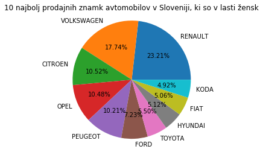

# Analiza prometa v Sloveniji

## Opis podatkov

### Prometne nesreče
Podatke o prometnih nesrečah smo pridobili iz spletne strani policija.si, kjer so objavljeni podatki o vseh prometnih nesrečah od leta 1995 do leta 2020. Za vsako nesrečo imamo podatke o vozilu, poškodbah, cestišču, itd. Pri nekaterih nesrečah niso znani vsi podatki, zato je bilo potrebno pri določenih izračunih upoštevati le tiste podatke, ki so bili korektni.

### Registrirana vozila v Sloveniji
Vse podatke o registriranih vozilih smo pridobili na podatki.gov.si, kjer so vidni vsi podatki o trenutno registriranih vozilah v Sloveniji do vključno leta 2020.  
V datoteki imamo vidne podatke o lastniku vozila in vozilu.

### Napake na tehničnih pregledih
Tabelo s podatki smo dobili s spletne strani https://podatki.gov.si. V tabeli so zapisani podatki o neuspešnih tehničnih pregledih.

### Javni promet
Podatke o javnem prometu so pridobljeni iz spletne strani https://pxweb.stat.si/SiStatData.

## Vizualizacija

### Prometne nesreče
Najprej nas je zanimalo koliko je vseh tipov nesreč in kakšen je njihov delež. Ugotovili smo, da je najbolj pogost tip nesreče bočno trčenje, čeprav smo predvidevali, da bo najbolj pogost tip nesreče oplaženje.

Nadaljevali smo z deležem uporabe varnostnega pasu pri različnih tipih nesreč. Pri predvidevanju smo se zopet zmotili, saj smo mislili, da bo največji delež neuporabe varnostnega pasu pri trčenju v stoječe/parkirano vozilo. Po izračunih smo ugotovili, da je največ nepripetih pasov pri povoženju pešca in to več kot 25%, najmanj pa pri naletnem trčenju, manj kot 2%.

Zanimalo nas je tudi kakšen je delež moških in žensk, ki so bili pri prometni nesreči pod vplivom alkohola. Ugotovili smo, da je delež moških pod vplivom alkohola približno 3-krat večji kot delež žensk pod vplivom alkohola.

Po teh izračunih smo naredili še graf, ki prikazuje vzrok nesreče glede na spol in graf, ki prikazuje tipe nesreč glede na stanje prometa.

### Registrirana vozila v Sloveniji
V podatkih smo razbrali koliko vozil je v sloveniji registriranih, ocenili smo njihov delež in zaradi prevelikega števila znamk smo se omejili le na 10 najpogostejših. Seveda se pri voznem parku razlikuje ali je lastnik moški ali ženska.

    

Preverili smo kakšen delež vseh osebnih vozil je v lasti fizične osebe in kakšen delež je od pravne osebe.

Kot zadnje nas je pa zanimala povprečna starost lastnikov najpopularnejših znamk

### Tehnični pregledi

Najprej smo si hoteli pogledati, kateri tip vozila najpogosteje ne pride čez tehnični pregled. Vidimo, da je osebnih avtomobilov največ.

 
Nato smo si hoteli pogledati, kakšen je delež napak posameznega tipa.

 
Vidimo, da ima velika večina vozil težave z svetlobno in električno opremo.
  
Hoteli smo preveriti, če so določeni tipi napak pogostejši glede na tip vozila. 

Opazimo, da velika večina vozil ne opravi tehničnega pregleda zaradi svetlobne in električne opreme. Pri tovornih vozilih, traktorjih in vlečnih vozilih je dokaj pogosta napaka druga oprema(oprema manjka ali pa ni v skladu z zahtevami).

### Javni promet

Preučili smo kako je porazdeljena uporaba javnega prevoza po Sloveniji v zadnjih 10ih letih.

>>>>>>> 9ff22686e4eaf221e9396f1c2781eb66d06d43c0

## Trenutni rezultati

### Prometne nesreče
Tipi nesreč in njihov delež: 

OPLAŽENJE: 0.13770479223420173  
POVOŽENJE PEŠCA: 0.02586041514791083  
ČELNO TRČENJE: 0.08671296473928558  
TRČENJE V STOJEČE / PARKIRANO VOZILO: 0.1659056900587039  
PREVRNITEV VOZILA: 0.046848022100295435  
TRČENJE V OBJEKT: 0.09185435291409277  
BOČNO TRČENJE: 0.203660361431915  
NALETNO TRČENJE: 0.1327936154702068  
OSTALO: 0.09661205540421287  
POVOŽENJE ŽIVALI: 0.012047730499175076  

---

Delež neuporabe varnostnega pasu pri različnih tipih nesreč:

OPLAŽENJE: 0.07773753134577877  
POVOŽENJE PEŠCA: 0.27002967359050445  
ČELNO TRČENJE: 0.07168141592920355  
TRČENJE V STOJEČE / PARKIRANO VOZILO: 0.1769195189639223  
PREVRNITEV VOZILA: 0.17362817362817362  
TRČENJE V OBJEKT: 0.11821219715956557  
BOČNO TRČENJE: 0.06857573474001508  
NALETNO TRČENJE: 0.016180294712510836  
OSTALO: 0.12708498808578236  
POVOŽENJE ŽIVALI: 0.12738853503184713  

---

Delež voznikov pod vplivom alkohola: 0.06570014958002532  
Delež žensk, ki so vozile pod vplivom alkohola: 0.026043613707165108  
Delež moških, ki so vozili pod vplivom alkohola: 0.08333333333333333  

---

Delež nesreč z materialno škodo: 0.6526291565987804  
Delež nesreč z lažjo telesno poškodbo: 0.2992367583323745  
Delež nesreč s hudo telesno poškodbo: 0.04222759176159245  
Delež nesreč s smrtnim izidom: 0.005906493307252713  

---

Možnost preživetja če imamo pripet varnostni pas v prometni nesreči: 0.9948077394072986  
Možnost preživetja če nimamo pripetega varnostnega pasu v prometni nesreči: 0.9857303792714983  

---

## Vprašanja na katera želimo odgovoriti

### Prometne nesreče
Kakšen je bil delež voznikov pod vplivom alkohola pred desetimi leti v primerjavi z letom 2020?
Kakšen je bil delež uporabe varnostnih pasov pred desetimi leti?
So se s povečanjem prometa skozi leta bistveno spremenili vzroki za nesrečo?
Kakšni pogoji in stanje voznika so najbolj varni za udeležbo v prometu?

### Registrirana vozila v Sloveniji
Katere so 10 najbolje prodajnih znamk avtomobilov v Sloveniji glede na spol?
Povprečna starost voznikov po znamkah?
Kakšen delež je v lasti fizičnih oseb in pravnih oseb?

### Tehnični pregledi
Kateri tipi vozil imajo največ problemov na tehničnih pregledih, kakšen tip napake je najpogostejši za določen tip vozila.
Ali se je zanesljivost različnih znamk avtomobilov z leti spremenila. 
Ali verjetnost, da avto uspešno opravi tehnični pregled zavisi od tipa motorja in starosti vozila.

### Javni promet
Kako se je razvijala uporaba javnega prometa skozi čas?
Ali lahk predvidimo povečano povpraševanje po avtobusih/vlakih?
